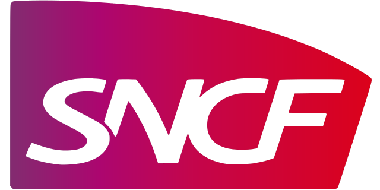

---
# ORACLE Cloud-Native DevOps workshop #

## Introduction ##

Oracle Cloud is the industry’s broadest and most integrated public cloud. It offers best-in-class services across software as a service (SaaS), platform as a service (PaaS), and infrastructure as a service (IaaS), and even lets you put Oracle Cloud in your own data center. Oracle Cloud helps organizations drive innovation and business transformation by increasing business agility, lowering costs, and reducing IT complexity. The workshop content shows different aspects of Application Development in the cloud with different set of Oracle Cloud Services.

### Prerequisites ###

Get the following account details ready to complete the tutorial and replace to your values when it is required:

+ Oracle Cloud account **username** and **password**
+ Oracle Cloud **identity domain**
+ **Data center/region**

NOTE: Before you start to use your new Oracle Public Cloud services make sure that the replication policy has been set for your account. Otherwise you can not create storage container which is necessary for most of the services. See [Selecting a Replication Policy for Oracle Storage Cloud Service](https://docs.oracle.com/cloud/latest/storagecs_common/CSSTO/GUID-5D53C11F-3D9E-43E4-8D1D-DDBB95DEC715.htm).

### Important ###

During the execution you will create several public cloud service instances what will be available on the world wide web. Even if these instances are for demo purposes keep in mind it is not a best practice to use weak or known (stored here in the tutorial) passwords especially in such open environment. Thus this workshop content does not recommend any password so you need to define those. You will be asked to provide password at certain points and please remember them  for  later usage. 

The content contains several independent modules that cover different aspects of the application development in the Oracle Cloud. These modules could be executed independently unless you find in the Prerequisites that they are dependendent on each other. 

----

####Run Lightweight Java container in the  Oracle Application Container Cloud Service####

+ [Deploy Apache Tomcat based application to Oracle Application Container Cloud](accs-tomcat/README.md)
+ [Scale up/down Application Container Service using user interface and PaaS Service Manager (PSM) Command Line Interface (CLI) tool](accs-psm/README.md)

####Deploy sample app to lightweight Java container and monitor the application using Oracle Management Cloud Service####
+ [Deploying APM Agent on Apache Tomcat based application and setting up Application Performance Monitoring](apm/README.md)

####Support SpringBoot application development lifecycle using Oracle Developer Cloud Service, Application Container Cloud Service and Oracle Enterprise Pack For Eclipse####

+ [Create Oracle Developer Cloud Service project for SpringBoot application](springboot-sample/create.devcs.project.md)
+ [Create continuous build integration using Oracle Developer Cloud Service and Oracle Application Container Cloud Service](springboot-sample/devcs.accs.ci.md)
+ [Using Eclipse IDE (Oracle Enterprise Pack for Eclipse) with Oracle Developer Cloud Service](oepe/setup.oepe.md)

####Bind Frontend Application running on lightweight container in Oracle Appplication Container Cloud with backend resources running on Java Cloud Service####

+ [Implement new function (REST client) in SpringBoot sample application using Service Bindings to access Oracle Java Cloud Services](https://github.com/oracle-weblogic/weblogic-innovation-seminars/blob/caf-12.2.1/cloud.demos/jcs.basics/change.mgmt.devcs.md)

####Perform basic monitoring of application run inside Application Container Cloud thrugh diagnostic capabilities of Java Mission Control and Java Flight Recorder ####

+ [Monitor and tune SpringBoot application deployed on Oracle Application Container Cloud Service](monitor-tune/README.md)

#### Deploy Java EE application to Oracle Java Cloud Service####

+ [Create Database Cloud Service Instance using user interface](dbcs-create/README.md)
+ [Create Java Cloud Service Instance using user interface](jcs-create/README.md)
+ [Prepare Database Cloud Service Instance to store sample application's data](dbcs-prepare/README.md)
+ [Deploy Java EE sample application to Oracle Java Cloud Service using Admin console](jcs-deploy/README.md)

####Manage Oracle Java Cloud Service using UI and PaaS Service Manager####

+ [Direct access and management of Oracle Java Cloud Service](jcs-direct/README.md)
+ [Scale-Out Oracle Java Cloud Service using user interface](jcs-scale-ui/README.md)
+ [Scale-In Oracle Java Cloud Service using PaaS Service Manager (PSM) Command Line Interface (CLI)](jcs-scale-psm/README.md)

####Making Java Cloud Service elasticly sclable through Policy based Auto-scaling####
+ [Oracle Java Cloud Service Policy Based Auto Scaling](jcs-autoscale/README.md)

####Upgrade WebLogic Server 11g (10.3.6) running on premise to 12cR2 with Multitenancy and migrate to Java Cloud Service####

+ [Convert WebLogic 11g domain into the 12cR2 partition using DPCT (Domain to Partition Conversion Tool)](dpct/README.md)
+ [Move partition from WebLogic Server 12cR2 to Oracle Java Cloud Service](lift-and-shift/README.md)

####Migrate Weblogic 10.3.6 (on premise) Application to Java Cloud Service with App2Cloud tool ####

+ [Migrate Weblogic 10.3.6 (on premise) Application to Java Cloud Service with App2Cloud tool](app-2-cloud/README.md)

####Clean up the environment####

+ [Delete Java Cloud, Database Cloud and Database Container Services using user interface](cleanup/cleanup-ui.md)
+ [Delete Application Cloud Container Service using PaaS Service Manager (PSM) Command Line Interface (CLI)](cleanup/cleanup-psm.md)

---
 
####Customizing and personalizing the workshop content####
 
+ [Customize and personalize the workshop materials](customize/README.md)

---

## [Contributing](CONTRIBUTING.md)
Pull Requests are currently not being accepted. See [CONTRIBUTING](CONTRIBUTING.md) for details.

## [License](LICENSE.md)
Copyright (c) 2014, 2016 Oracle and/or its affiliates
The Universal Permissive License (UPL), Version 1.0
