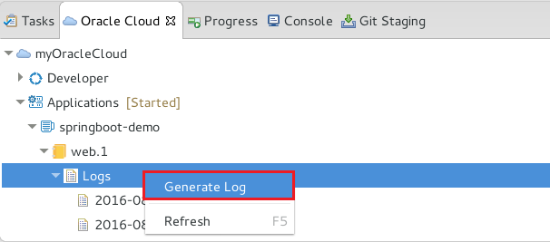
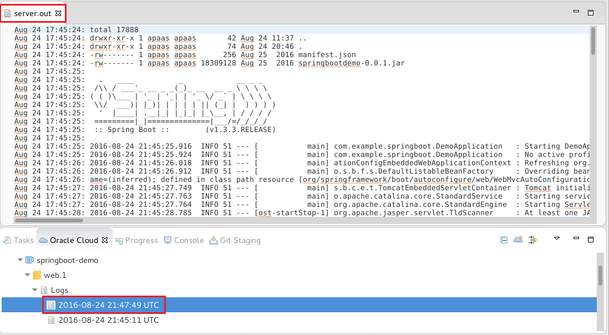
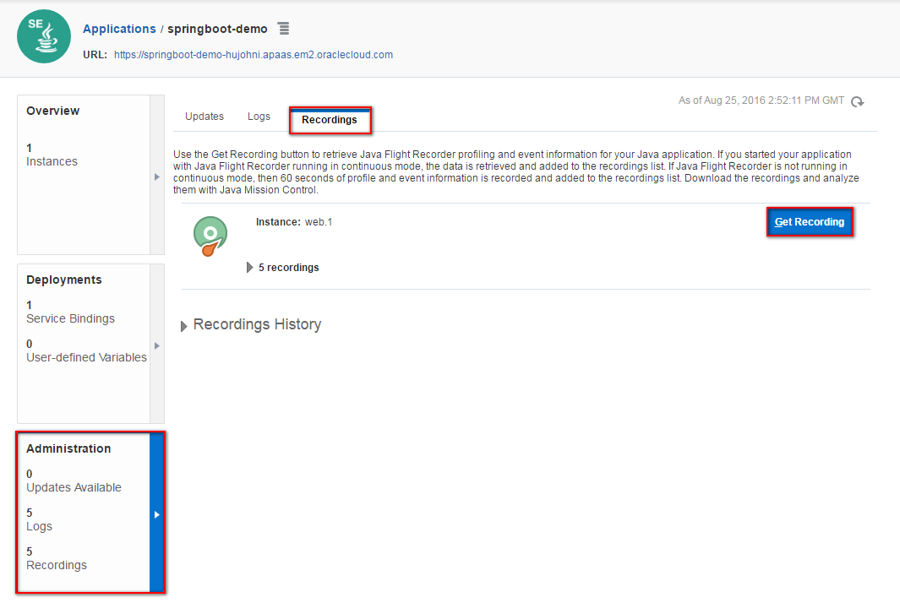
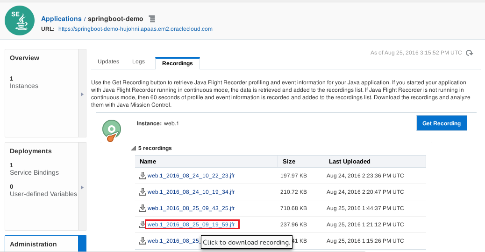
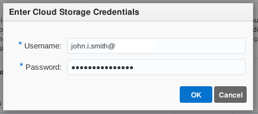
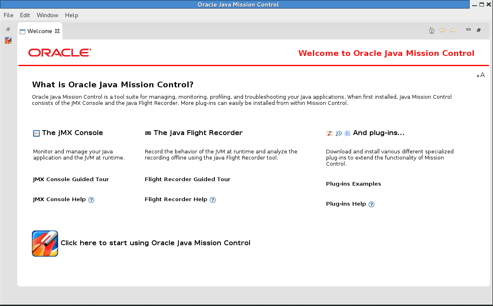
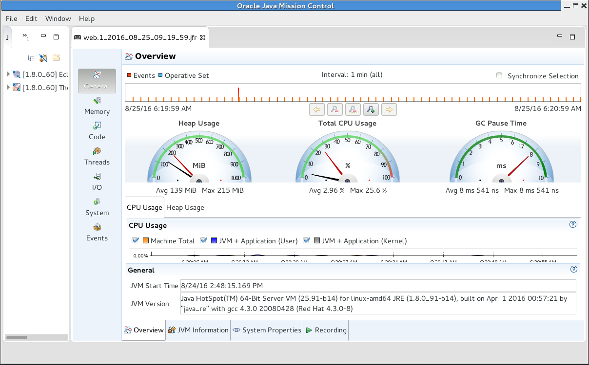

---
# ORACLE Cloud-Native DevOps workshop #
-----
## Monitor and tune SpringBoot application deployed on Oracle Application Container Cloud Service ##

### Introduction ###
You may want to check your application logs to monitor the application or troubleshoot a problem. The logs are stored on Oracle Storage Cloud Service. You can also monitor your Java applications using Java Flight Recorder and Java Mission Control. Additionally, applications can write to log files that are stored on Oracle Storage Cloud Service.

Java Mission Control (JMC) enables you to monitor and manage Java applications without introducing the performance overhead normally associated with these types of tools. It uses data collected for normal adaptive dynamic optimization of the Java Virtual Machine (JVM). Besides minimizing the performance overhead, this approach eliminates the problem of the observer effect, which occurs when monitoring tools alter the execution characteristics of the system.

Java Flight Recorder (JFR) collects and saves detailed performance characteristics for historic analysis and profiling. When used as a plug-in for the JMC client, it presents diagnostic information in logically grouped tables, charts, and dials.

You can record 60 seconds of information at a time on each application. If you have multiple instances, each instance generates a recording. Then you can examine the data retrieved using Java Mission Control, and make necessary adjustments based on that data.

### About this tutorial ###
This tutorial demonstrates how to:
  
+ Retreive and check application log using OEPE Cloud Tooling
+ Create and retreive Java Flight Recorder log and open in Java Mission Control

### Prerequisites ###

+ [Create Oracle Developer Cloud Service project for Spring Boot sample application](springboot-sample/create.devcs.project.md)
+ [Create continuous build integration using Oracle Developer Cloud Service and Oracle Application Container Cloud Service](springboot-sample/devcs.accs.ci.md)
+ [Using Eclipse IDE (Oracle Enterprise Pack for Eclipse) with Oracle Developer Cloud Service](oepe/setup.oepe.md)

### Steps ###

#### Retreive application log using OEPE Cloud Tooling ####

Open OEPE and Activate your cloud connection. To open logs in OEPE activate your cloud connection and open myOracleCloud(cloud connection name) -> Applications -> springboot-demo(ACCS application name) -> web.1 -> Logs

If there is no log right click on Logs and select Generate Log menu item. It may take some time while Application Container Cloud Service packs the latest log of the application.

Now select a log from the list under the Logs tree item. To open double click or right click on the selected log and select Open. The log will open OEPE and you can see the content.

The log basically stored on Oracle Cloud Storage Service belongs to your identity domain. Thus you can also use the REST API to get the packed log file. For more information see the [documentation](http://docs.oracle.com/cloud/latest/apaas_gs/DVCJV/GUID-19455093-3D4E-46AD-B203-37BA1BB51874.htm#DVCJV-GUID-19455093-3D4E-46AD-B203-37BA1BB51874)

#### Create and retrieve Java Flight Recorder log using Application Container Cloud Service user interface ####

[Sign in](https://github.com/oracle-weblogic/weblogic-innovation-seminars/blob/caf-12.2.1/cloud.demos/jcs.basics/sign.in.to.oracle.cloud.md) to [https://cloud.oracle.com](https://cloud.oracle.com). On the dashboard click Application Container tile and click Instances to open Application Cloud Service Console.

Click on the Application Container Cloud Service instance (springboot-demo).

On the detail page click on Administration tile then select Recordings tab. To create Java Flight Recorder log click Get Recording button.

Obviously this is not the only and most likely the best way to record detailed information when your application is struggling to serve the requests. Behind the button it is also a simple call to management interface using REST. For example you can use any other monitoring system to trigger this step when that recognizes any performance issue.

The recording will take 60 seconds. During this time use your browser and continuously refresh the page (Ctrl+R) to generate activity on the server side. Once the log ready and displayed click on the log name.

You might need to enter your credentials again. Do it and remember the location where the log file was downloaded.

The Java Flight Recorder in itself is a profiling and event collection framework built into the Oracle JDK. To analyze this log you need Java Mission Control. Java Mission Control is an advanced set of tools that enables efficient and detailed analysis of the extensive of data collected by Java Flight Recorder. Java Mission controller is also part of the Oracle JDK. To open execute the following:

  [oracle@localhost Desktop]$ /usr/java/latest/bin/jmc 

This will start the graphical user interface of Java Mission Control.

Close the Welcome page and click File -> Open File... and select the previously downloaded Java Flight Recordings. You should see something similar result:

On the Overview page you can see the peak Heap usage, CPU usage, GC Pause Time and generic information about the environment. You can find many information from many perspective to identify the application's performance issue. Unfortunately the analysis of the result is a different area which requires deep knowledge about Java Virtual Machine and out the scope of this tutorial, but it is worth to surf among these information. To get more help about Java Mission Control see its page on [Oracle Technology Network](http://www.oracle.com/technetwork/java/javaseproducts/mission-control/java-mission-control-1998576.html)